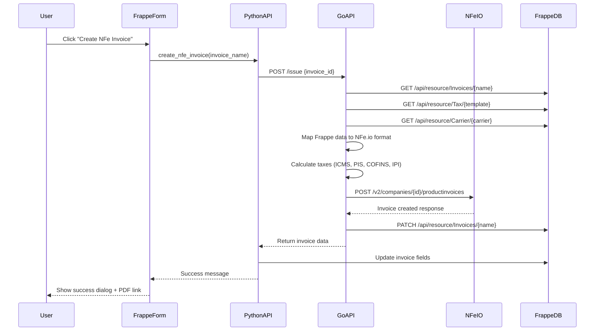

# Frappe Brazil Invoice Integration

This document describes the complete integration between the Go NFe.io API and the Frappe Brazil Invoice custom app.

## Overview

The integration allows you to create Brazilian electronic invoices (NFe) directly from Frappe using the NFe.io service. The architecture consists of:

1. **Go API Service** (nfe-go): Backend service that handles NFe.io API communication
2. **Frappe Custom App** (frappe_brazil_invoice): Frontend Frappe app with Invoices DocType
3. **Python API Endpoints**: Bridge between Frappe and Go service

## Architecture

```
┌─────────────────┐      ┌──────────────┐      ┌──────────────┐
│  Frappe Form    │─────▶│  Python API  │─────▶│   Go API     │
│  (invoices.js)  │      │ (invoices.py)│      │ (issuer.go)  │
└─────────────────┘      └──────────────┘      └──────────────┘
        │                        │                      │
        │                        │                      ▼
        │                        │              ┌──────────────┐
        │                        │              │  NFe.io API  │
        │                        │              │   Service    │
        │                        │              └──────────────┘
        │                        ▼
        │                ┌──────────────┐
        └───────────────▶│    Frappe    │
                         │   Database   │
                         └──────────────┘
```

## Data Flow

### 1. Invoice Creation Flow



## Components

### 1. Go Service (internal/service/issuer.go)

**Main Method**: `IssueNoteForFrappeInvoice(invoiceID string)`

**Process**:
1. Fetch invoice data from Frappe (`/api/resource/Invoices/{name}`)
2. Fetch tax template from Frappe (`/api/resource/Tax/{template}`)
3. Fetch carrier data from Frappe (`/api/resource/Carrier/{carrier}`)
4. Map Frappe data to NFe.io format
5. Calculate taxes using TaxService
6. Send to NFe.io API
7. Update Frappe invoice with response data

**Key Services Used**:
- `FrappeRepository.GetInvoice()` - Fetch invoice from Frappe
- `FrappeRepository.GetTax()` - Fetch tax template
- `FrappeRepository.GetCarrier()` - Fetch carrier info
- `FrappeRepository.UpdateInvoice()` - Update invoice with NFe.io response
- `TaxService.CalculateTax()` - Calculate Brazilian taxes
- `NFeRepository.CreateProductInvoice()` - Send to NFe.io

### 2. Frappe Models (internal/models/frappe.go)

**Invoices DocType**:
```go
type Invoices struct {
    Name                  string        `json:"name"`              // INV-YYYY-####
    OperationType         string        `json:"operation_type"`
    ClientType            string        `json:"client_type"`       // PF/PJ
    ClientName            string        `json:"client_name"`
    ClientIDNumber        string        `json:"client_id_number"`  // CPF/CNPJ
    ClientEmail           string        `json:"client_email"`
    InscricaoEstadual     string        `json:"inscricao_estadual"`
    ContribuinteIcms      string        `json:"contribuinte_icms"`
    TaxTemplate           string        `json:"tax_template"`      // Link to Tax
    Carrier               string        `json:"carrier"`           // Link to Carrier
    InvoicesTable         []ItemInvoice `json:"invoices_table"`    // Child table
    
    // Delivery address
    DeliveryAddress       string        `json:"delivery_address"`
    DeliveryCEP           string        `json:"delivery_cep"`
    DeliveryNeighborhood  string        `json:"delivery_neighborhood"`
    City                  string        `json:"city"`
    DeliveryState         string        `json:"delivery_state"`
    DeliveryIBGE          string        `json:"delivery_ibge"`
    
    // NFe.io response
    InvoiceID             string        `json:"invoice_id"`
    InvoiceSerie          string        `json:"invoice_serie"`
    InvoiceLink           string        `json:"invoice_link"`      // PDF URL
    
    // Totals
    Total                 float64       `json:"total"`
    TotalTax              float64       `json:"total_tax"`
}
```

**ItemInvoice (Child Table)**:
```go
type ItemInvoice struct {
    SerialNumber  string  `json:"serial_number"`
    ItemCode      string  `json:"item_code"`
    ItemName      string  `json:"item_name"`
    Rate          float64 `json:"rate"`
    Quantity      int     `json:"quantity"`
    NCM           string  `json:"ncm"`
    InvoiceTaxes  string  `json:"invoice_taxes"`  // Link to Tax
    ICMSRate      string  `json:"icms_rate"`
    IPIRate       string  `json:"ipi_rate"`
    PISRate       string  `json:"pis_rate"`
    COFINSRate    string  `json:"cofins_rate"`
    RateTaxes     float64 `json:"rate_taxes"`
}
```

**FrappeTax (Tax Template)**:
```go
type FrappeTax struct {
    Name                string  `json:"name"`
    
    // ICMS
    OriginICMS          string  `json:"origin_icms"`
    CSTICMS             string  `json:"cst_icms"`
    AliqICMS            float64 `json:"aliq_icms"`
    
    // IPI
    CSTIPI              string  `json:"cst_ipi"`
    AliquotaIPI         float64 `json:"aliquota_ipi"`
    
    // PIS
    CSTPis              string  `json:"cst_pis"`
    AliquotaPis         float64 `json:"aliquota_pis"`
    
    // COFINS
    CSTCofins           string  `json:"cst_cofins"`
    AliquotaCofins      float64 `json:"aliquota_cofins"`
}
```

### 3. Python API (invoices.py)

**Endpoint**: `create_nfe_invoice(invoice_name)`

**Features**:
- Whitelisted API method (accessible via frappe.call)
- Calls Go API at configured endpoint
- Updates invoice with response data
- Shows success message with PDF link
- Handles errors with user-friendly messages

**Endpoint**: `get_invoice_status(invoice_name)`

**Features**:
- Check current status of NFe invoice
- Queries Go API for latest status
- Returns status information to form

### 4. Form JavaScript (invoices.js)

**Buttons Added**:

1. **"Create NFe Invoice"** - Shows when:
   - Document is submitted (docstatus === 1)
   - Invoice not yet created (!invoice_id)
   - Calls `create_nfe_invoice` endpoint
   - Shows loading message during creation

2. **"Check NFe Status"** - Shows when:
   - Invoice ID exists (invoice_id is set)
   - Calls `get_invoice_status` endpoint
   - Displays current status in dialog

3. **"View NFe PDF"** - Shows when:
   - Invoice link exists (invoice_link is set)
   - Opens PDF in new browser tab

## Configuration

### Go Service Configuration

**Environment Variables**:
```bash
# Frappe API
FRAPPE_URL=https://your-frappe-site.com
FRAPPE_API_KEY=your_api_key
FRAPPE_API_SECRET=your_api_secret

# NFe.io API
NFEIO_API_KEY=your_nfeio_api_key
NFE_ENDPOINT=https://api.nfe.io/v2/companies/{company_id}/productinvoices
NFE_ENDPOINT_CONSULT=https://api.nfe.io/v2/companies/{company_id}/productinvoices
COMPANY_ID=your_nfeio_company_id

# Server
PORT=3000
```

**Starting the Service**:
```bash
cd c:\Users\Luigi\Desktop\nfe-go
go run cmd/main.go
```

**Or using Docker**:
```bash
docker build -t nfe-go .
docker run -p 3000:3000 --env-file .env nfe-go
```

### Frappe Configuration

Add to your `site_config.json`:
```json
{
  "nfe_go_api_url": "http://localhost:3000"
}
```

Or if running in production:
```json
{
  "nfe_go_api_url": "https://your-go-api-domain.com"
}
```

## API Endpoints

### Go Service Endpoints

#### POST /issue
Create a new NFe invoice

**Request**:
```json
{
  "invoice_id": "INV-2025-0001"
}
```

**Response**:
```json
{
  "id": "nfe_io_invoice_id",
  "status": "waiting",
  "environment": "production",
  "flowStatus": "pending",
  "pdf": "https://api.nfe.io/v2/companies/xxx/productinvoices/xxx/pdf",
  "xml": "https://api.nfe.io/v2/companies/xxx/productinvoices/xxx/xml"
}
```

#### GET /invoice/:id
Get invoice status from NFe.io

**Response**:
```json
{
  "id": "nfe_io_invoice_id",
  "status": "authorized",
  "environment": "production",
  "flowStatus": "issued"
}
```

### Python API Methods

#### frappe_brazil_invoice.brazil_invoice.doctype.invoices.invoices.create_nfe_invoice

**Args**:
- `invoice_name`: Name of the Invoices document

**Returns**:
```python
{
  "success": True,
  "message": "Invoice created successfully",
  "data": {
    "id": "...",
    "status": "...",
    "pdf": "..."
  }
}
```

#### frappe_brazil_invoice.brazil_invoice.doctype.invoices.invoices.get_invoice_status

**Args**:
- `invoice_name`: Name of the Invoices document

**Returns**:
```python
{
  "success": True,
  "data": {
    "id": "...",
    "status": "...",
    "environment": "...",
    "flowStatus": "..."
  }
}
```

## Field Mappings

### Frappe → NFe.io Mapping

| Frappe Field | NFe.io Field | Notes |
|-------------|--------------|-------|
| `client_name` | `buyer.name` | Client name |
| `client_id_number` | `buyer.federalTaxNumber` | CPF/CNPJ (numeric only) |
| `client_email` | `buyer.email` | |
| `inscricao_estadual` | `buyer.stateTaxNumber` | State registration |
| `contribuinte_icms` | `buyer.stateTaxNumberIndicator` | Mapped: Sim→taxPayer, Isento→exempt |
| `delivery_address` | `buyer.address.street` | |
| `delivery_cep` | `buyer.address.postalCode` | |
| `delivery_neighborhood` | `buyer.address.district` | |
| `city` | `buyer.address.city.name` | |
| `delivery_state` | `buyer.address.state` | |
| `delivery_ibge` | `buyer.address.city.code` | |
| `freight_modality` | `transport.freightModality` | Mapped: 0→byIssuer, 1→byReceiver, etc. |
| `product_quantity` | `transport.volume.volumeQuantity` | |
| `product_type` | `transport.volume.species` | |
| `product_brand` | `transport.volume.brand` | |
| `product_gross_weight` | `transport.volume.grossWeight` | |
| `product_net_weight` | `transport.volume.netWeight` | |

### Item Mapping

| Frappe Field | NFe.io Field | Notes |
|-------------|--------------|-------|
| `item_name` | `items[].description` | |
| `ncm` | `items[].ncm` | NCM code |
| `rate` | `items[].unitAmount` | Unit price |
| `quantity` | `items[].quantity` | |
| Tax calculations | `items[].tax` | From TaxService |

### Tax Template Mapping

| Frappe Tax Field | NFe.io Tax Field |
|-----------------|------------------|
| `aliq_icms` | `tax.icms.rateAmount` |
| `cst_icms` | `tax.icms.situation` |
| `origin_icms` | `tax.icms.origin` |
| `aliquota_ipi` | `tax.ipi.rateAmount` |
| `cst_ipi` | `tax.ipi.situation` |
| `aliquota_pis` | `tax.pis.rateAmount` |
| `cst_pis` | `tax.pis.situation` |
| `aliquota_cofins` | `tax.cofins.rateAmount` |
| `cst_cofins` | `tax.cofins.situation` |

## Usage Example

### 1. Create Invoice in Frappe

1. Go to Invoices list
2. Create new Invoice
3. Fill in all required fields:
   - Client information (name, CPF/CNPJ, email)
   - Delivery address (CEP auto-fills address)
   - Select Tax Template
   - Add items to invoices_table
   - Select Carrier (optional)
4. Submit the document

### 2. Generate NFe

1. Click **"Create NFe Invoice"** button
2. Wait for processing (loading message shown)
3. Success dialog shows:
   - Invoice ID
   - Status
   - PDF link (clickable)
4. Document refreshes with:
   - `invoice_id` filled
   - `invoice_link` filled (PDF URL)
   - `invoice_serie` filled

### 3. Check Status

1. Click **"Check NFe Status"** button
2. Dialog shows current status:
   - ID
   - Status (waiting/authorized/rejected)
   - Environment (production/homologation)
   - Flow Status

### 4. View PDF

1. Click **"View NFe PDF"** button
2. PDF opens in new tab

## Tax Calculations

The Go service automatically calculates all Brazilian taxes using the `TaxService`:

### ICMS (State Tax)
```go
BaseCalc = ItemValue * Quantity
TaxValue = BaseCalc * (AliqICMS / 100)
```

### PIS (Social Integration Program)
```go
BaseCalc = ItemValue * Quantity
TaxValue = BaseCalc * (AliquotaPis / 100)
```

### COFINS (Social Security Financing)
```go
BaseCalc = ItemValue * Quantity
TaxValue = BaseCalc * (AliquotaCofins / 100)
```

### IPI (Industrialized Products Tax)
```go
BaseCalc = ItemValue * Quantity
TaxValue = BaseCalc * (AliquotaIPI / 100)
```

### DIFAL (Interstate Tax Difference)
Calculated when buyer and seller are in different states.

## Error Handling

### Common Errors

**1. "Could not connect to Go API"**
- Solution: Ensure Go service is running
- Check: `http://localhost:3000/health`

**2. "Request to Go API timed out"**
- Solution: Increase timeout in invoices.py (currently 30s)
- Check NFe.io API status

**3. "Failed to get tax template"**
- Solution: Ensure Tax template exists and is linked correctly
- Verify Tax doctype permissions

**4. "Invalid tax number"**
- Solution: Check CPF/CNPJ format (must be numeric, 11 or 14 digits)
- Remove special characters

### Debugging

**Enable Go service logging**:
```bash
# In cmd/main.go
app.Use(logger.New())
```

**Check Frappe error log**:
```bash
bench --site your-site tail
```

**Check Go service logs**:
```bash
# Console output when running with `go run cmd/main.go`
```

## Testing

### Test with Postman

**Create Invoice**:
```http
POST http://localhost:3000/issue
Content-Type: application/json

{
  "invoice_id": "INV-2025-0001"
}
```

**Check Status**:
```http
GET http://localhost:3000/invoice/nfe_io_invoice_id
```

### Test in Frappe

1. Create a test invoice
2. Use NFe.io homologation environment
3. Check all fields are populated correctly
4. Submit and create NFe
5. Verify PDF is generated
6. Check Frappe database for updated fields

## Production Checklist

- [ ] Configure production NFe.io API keys
- [ ] Set `environment` to `production` in Go service
- [ ] Update `nfe_go_api_url` to production domain
- [ ] Set up SSL certificates for Go API
- [ ] Configure firewall rules
- [ ] Set up monitoring and alerting
- [ ] Test with real CNPJ/CPF
- [ ] Verify tax calculations
- [ ] Test error scenarios
- [ ] Set up backup strategy
- [ ] Document runbook procedures

## Maintenance

### Updating Tax Rules
1. Modify `internal/service/tax.go`
2. Run tests: `go test ./internal/service`
3. Rebuild: `go build ./cmd`
4. Restart service

### Adding New Fields
1. Update `internal/models/frappe.go`
2. Update `internal/service/issuer.go` mapping
3. Update Frappe DocType JSON
4. Run: `bench migrate`

### Database Backups
- Frappe: `bench backup`
- Go config: Backup `.env` file

## Support

For issues or questions:
- GitHub Issues: https://github.com/AnyGridTech/frappe-nfe-bridge/issues
- Email: support@anygridtech.com

## License

Copyright (c) 2025 AnyGridTech
